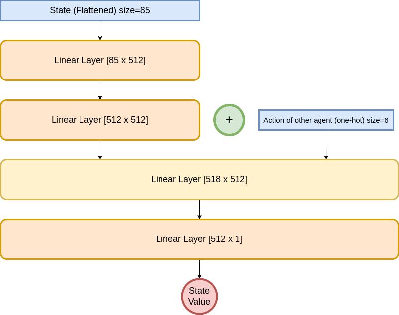

# MAPPO
Two Multi-Agent Reinforcement Learning algorithms implemented in PyTorch and applied on the KAZ PettingZoo environment.

Reference: https://arxiv.org/abs/2103.01955

Environment: https://pettingzoo.farama.org/environments/butterfly/knights_archers_zombies/

Note: `pretrained.zip` contains the code for an agent trained on the single-agent version of KAZ, it is possible to initialize the multi-agent algorithms either from scratch, or using this pretrained agent's weights.

It is possible to show that MAPPO outperforms IPPO when intialized from scratch, and IPPO converges faster when initialized with the pretrained weights.

This project implements two algorithms and compares them on the PettingZoo KAZ environment, which is a cooperation problem.

## Independent Proximal Policy Optimization (IPPO)

Each agent maintains its own actor and critic networks, and does not directly take into account the behavior of the other agent to take its own decisions.

## Multi-Agent Proximal Policy Optimization (MAPPO)

Each agent still learns its own actor network, but we have a centralized critic, that judges the action of an agent by taking into account the action of the other agent.

The critic's network architecture in this case is shown in the diagram below.

